> CHAPTER 1
>
> <u>COURSE NAME</u> SOFTWARE & SOFTWARE ENGINEERING
>
>  style="width:8.13139in;height:0.115in" />SOFTWARE ENGINEERING

CSC 3114 (UNDERGRADUATE)

> MD RAIHAN MAHMUD LECTURER, CS, AIUB
> [<u>raihan.mahmud@aiub.edu</u>](mailto:Raihan.mahmud@aiub.edu)

WHAT IS SOFTWARE ENGINEERING?

> Technologies that make it easier,faster,and less expensive to build
> high-quality computer programs
>
> A discipline aiming at producing fault-free software,delivered on
> time and within budget, that satisfies the users’ needs.
>
> An engineering: A set of activities in software production
>
> The philosophy of established engineering disciplines to solve what
> are termed software crisis
>
> RM

SCOPE OF SOFTWARE ENGINEERING

The aim of Software Engineering is to solve Software Crisis:

>  Late
>
>  Over budget
>
>  Low quality with lots of faults

Software crisis is still present over 35 years later!

> RM
>
> SOFTWARE CHARACTERISTICS

A logical (intangible) rather than a physical system element Being
developed or engineered but not being manufactured Software cost
concentrating in engineering,not in materials

Software does not“wearing out” but“deteriorating”(not destroyed after
lifetime like hardware,but backdated by aging that needs to update)

Software is a‘differentiator’ (different sub-systems,e.g.cashier’s
workstation in a supermarket) Without“spare parts” in software
maintenance (no extra useless features in software) Most software
continues to be custom-built (based on the requirements)

> RM

SOFTWARE DEVELOPMENT LIFE CYCLE (SDLC)

> A structured set of activities required to develop a software system
> The way we produce software, including:
>
> 1\. Planning
>
> 2\. Requirements Analysis 3. Design
>
> 4\. Development 5. Testing
>
> 6\. Final release / Deployment 7. Maintenance
>
> RM

SOFTWARE DEVELOPMENT LIFE CYCLE (SDLC)

> 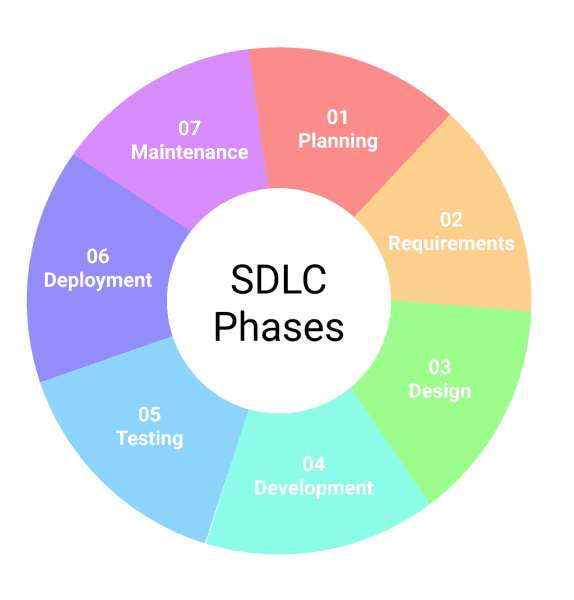6

GOOD & BAD SOFTWARE

Good software is maintained—bad software is discarded

Different types of maintenance

>  Corrective maintenance \[about 20%\] - Modification to fix a problem
>
>  Enhancement \[about 80%\]
>
> \- Perfective maintenance (modification to improve usability,…)
> \[about 60%\] - Adaptive maintenance (modification to keep up-to-date)
> \[about 20%\]
>
> \- Preventive maintenance (modification to avoid any future error)
> \[about 20%\]
>
> RM

FAULTS IN SOFTWARE DEVELOPMENT PHASES

> 60 to 70 percent of faults are specification and design faults
>
> Data of Kelly,Sherif,and Hops \[1992\]  1.9 faults per page of
> specification  0.9 faults per page of design
>
>  0.3 faults per page of code
>
> Data of Bhandari et al.\[1994\]
>
> Faults at end of the design phase of the new version of the product
> 13% of faults from previous version of product
>
> 16% of faults in new specifications 71% of faults in new design
>
> RM

COST OF DETECTION & CORRECTION OF A FAULT

> 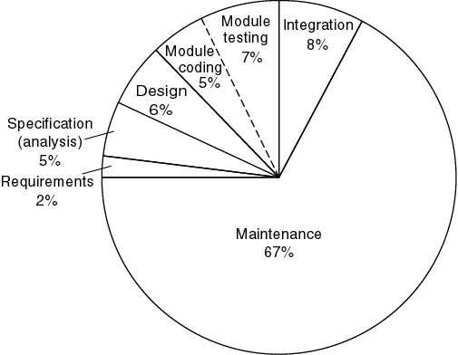 style="width:11.13333in;height:5.01667in" />RM

SOFTWAREAPPLICATION

>  System software (control computer hardware such as OS)
>
>  Business software (commercial application for business users
> \[SAP,ERP\]) Systems,Applications,and Products
>
> Enterprise Resource Planning
>
>  Engineering and scientific software (e.g.statistical
> analysis-SPSS,Matlab)  Embedded software (e.g.biometric device)
>
>  Personal computer software (e.g.Microsoft Office)
>
>  Web-based software (use over the internet with a browser,e.g.Gmail)
>  Artificial intelligence software (e.g.HCI,Google AI)
>
> RM

SOFTWARE MYTHS (MANAGEMENT)

> Myth 1: We already have a book full of standards and procedures for
> building software. Wouldn’t that provide my people with everything
> they need to know?
>
> Myth 2:My people have state-of-the-art software development tools;we
> buy them the newest computers.
>
> Myth 3:If we get behind schedule,we can add more programmers and
> catch up.
>
> Myth 4: If I outsource the software project to a third party,I can
> relax and let that firm build it.
>
> RM

SOFTWARE MYTHS (CLIENT)

> Myth 1:A general statement of objectives is sufficient to begin
> writing programs – we can fill in the details later.
>
> Myth 2:Project requirements continually change,but change can be
> easily accommodated because software is flexible.
>
> RM

SOFTWARE MYTHS (PROFESSIONAL)

> Myth 1:Our job is done once we write the program and get it to work.
>
> *Fact:the* *sooner* *you* *begin* *writing* *code,the* *longer* *it*
> *will* *take* *you* *to* *get* *done.*
>
> Myth 2:I cannot assess the program's quality until it is“running."
>
> Myth 3:The working program is the only deliverable work product for a
> successful project.
>
> Myth 4: Software engineering will make us create very large and
> unnecessary documentation,invariably slowing us down.
>
> RM
>
> WHY SYSTEM FAILS?

The system fails to meet the business requirements for which it was
developed.The system is either abandoned or expensive adaptive
maintenance is undertaken.

There are performance shortcomings in the system, which make it
inadequate for the users’ needs. Again,it is either abandoned or amended
incurring extra costs.

Errors appear in the developed system causing unexpected
problems.Patches have to be applied at extra cost.

Users reject the implemented system, lack of involvement in its
development or lack of commitment to it.

Systems are initially accepted but over time become un-maintainable and
so pass into disuse.

> RM

REFERENCES

> R.S.Pressman & Associates,Inc.(2010).*Software* *Engineering:A*
> *Practitioner’s* *Approach.*
>
> Kelly,J. C., Sherif,J. S., & Hops,J. (1992).An analysis of defect
> densities found during software inspections.*Journal* *of* *Systems*
> *and* *Software*,*17*(2), 111-117.
>
> Bhandari,I.,Halliday,M. J., Chaar,J., Chillarege,R.,Jones,
> K.,Atkinson, J. S., & Yonezawa,M. (1994). In-process improvement
> through defect data interpretation.*IBM* *Systems* *Journal*,*33*(1),
> 182-214.
>
> RM

> CHAPTER 2
>
> <u>COURSE NAME</u> SOFTWARE DEVELOPMENT PROCESS MODEL
>
>  style="width:8.13139in;height:0.115in" />SOFTWARE ENGINEERING
>
> CSC 3114

(UNDERGRADUATE)

> MD RAIHAN MAHMUD LECTURER,CS, AIUB
> [<u>raihan.mahmud@aiub.edu</u>](mailto:Raihan.mahmud@aiub.edu)

SOFTWARE PROCESS

> A structured set of activities required to develop a software system
> A software process model is an abstract representation of a process.
> It presents a description of a process from some particular
> perspective
>
> RM

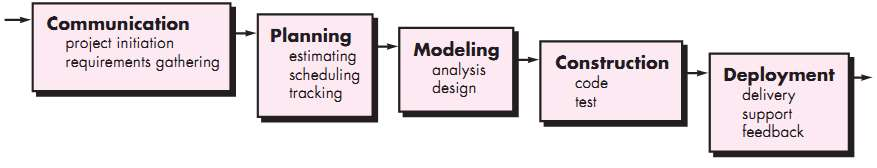

WATERFALL MODEL

> **The** **waterfall** **or** **linear** **sequential** **model**
> Problems of the Waterfall Model
>
> Inflexible partitioning of the project into distinct stages.The next
> phase starts only after the completion of the previous phase
>
> This makes it difficult to respond to changing customer requirements
> (no backtracking) Therefore,this model is only appropriate when the
> requirements are well-understood
>
> RM

V - MODEL

> 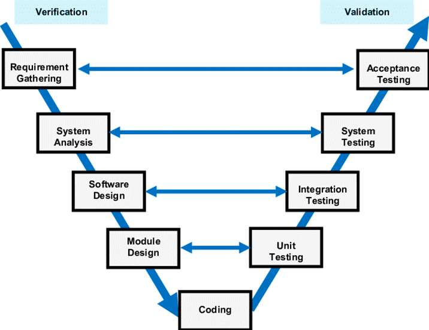 style="width:5.16667in;height:3.97667in" />The V-model is an SDLC
> model in which process execution happens sequentially in aV-shape. It
> is also known as aVerification andValidation model.
>
> V-Model is an extension of the waterfall model and is based on an
> association of a testing phase for each corresponding development
> stage.This means that every single phase in the development cycle has
> a directly associated testing phase.
>
> This is a highly disciplined model, and the next phase starts only
> after the completion of the previous phase.
>
> RM

PROTOTYPING MODEL

> 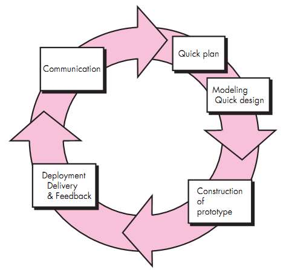Requirements
> are not precise,and the prototype serves as a mechanism for
> identifying software requirements
>
> Iteration occurs as the prototype is tuned to satisfy the needs of
> the customer
>
> System requirementsALWAYS evolve during a project,so process
> iteration is proper where earlier stages are reworked and is always
> part of the process for large systems
>
> RM

INCREMENTAL DEVELOPMENT

> Rather than delivering the system as a single delivery,development
> and delivery are broken down into increments,with each increment
> delivering part of the required functionality (SPIRAL).
>
> The requirements are relatively certain but there are many
> complexities that leads to frequent changes. User requirements are
> prioritized,and the highest priority requirements are included in
> early increments
>
> Once the development of an increment is started,the requirements are
> frozen though requirements for later increments can continue to evolve
>
> Analysis Design Code Test

Delivery increment \#1

> Analysis Design Code Test

Delivery increment \#2

> Analysis Design Code Test Delivery \#3
>
> Calendar time RM

RAPID APPLICATION DEVELOPMENT (RAD)

> It is a type of incremental model.The developments are
> time-boxed,delivered,and then assembled into a working prototype
>
> In the RAD model,the components or functions are developed in
> parallel as if they were mini projects (frozen requirements in each
> increment)
>
> This can quickly give the customer something to see and use and to
> provide feedback Delivers a fully functional system in 90 days,give
> or take 30 days
>
> Phases of RAD are:
>
>  Requirements Planning
>
>  User Design (user interacts with the system analysts)  Construction
> (program and application development)
>
>  Cutover (testing, changeover to new system, user training)
>
> RM

RATIONAL UNIFIED PROCESS (RUP)

> 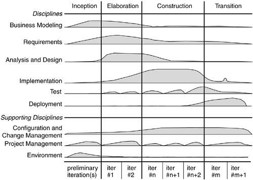 style="width:12.35667in;height:5.15667in" />RM

RISK PROFILE

> 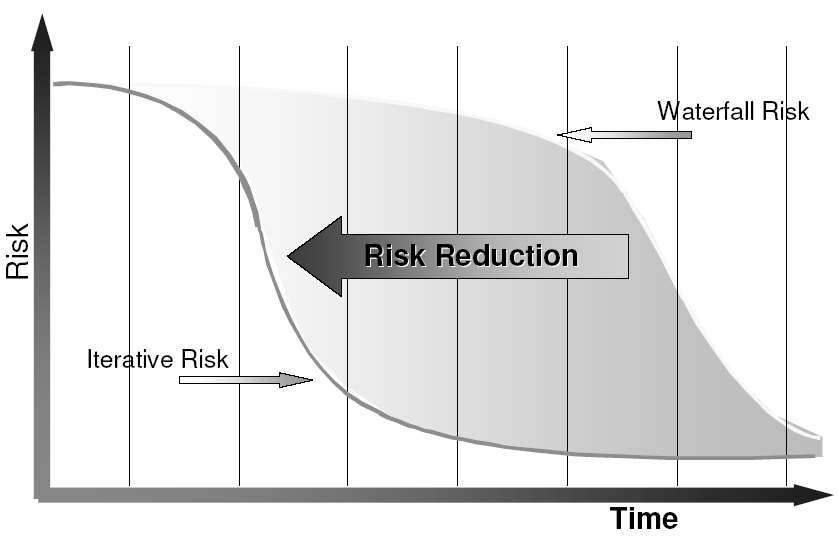 style="width:9.05333in;height:5.22667in" />RM

REFERENCES

> R.S.Pressman & Associates,Inc.(2010).*Software* *Engineering:A*
> *Practitioner’s* *Approach.*
>
> Kelly,J. C., Sherif,J. S., & Hops,J. (1992).An analysis of defect
> densities found during software inspections.*Journal* *of* *Systems*
> *and* *Software*,*17*(2), 111-117.
>
> Bhandari,I.,Halliday,M. J., Chaar,J., Chillarege,R.,Jones,
> K.,Atkinson, J. S., & Yonezawa,M. (1994). In-process improvement
> through defect data interpretation.*IBM* *Systems* *Journal*,*33*(1),
> 182-214.
>
> RM

> CHAPTER 3
>
> <u>COURSE NAME</u> REQUIREMENTS ENGINEERING
>
>  style="width:6.12819in;height:0.115in" />**SOFTWARE** **ENGINEERING**
>
> CSC 3114

(UNDERGRADUATE)

> MD RAIHAN MAHMUD LECTURER,CS, AIUB
> [<u>raihan.mahmud@aiub.edu</u>](mailto:Raihan.mahmud@aiub.edu)

**Table** **of** **Contents**

> • Introduction to Requirements in Software Engineering • Types of
> Software Requirements
>
> • Requirements Engineering Phases
>
> • Challenges in Requirements Engineering
>
> • Impact of Poor Requirements on Software Projects • Boehm’s Law
>
> • User Stories vs SRS
>
> • The Requirements Baseline • Definition of Shift Left Testing
>
> **Introduction** **to** **Requirements** **in** **SE**

• The software requirements are description of features and
functionalities of the target system.

• A condition or capability needed by a user to achieve an objective, or
a condition or capability possessed by a system or system component.

solve a problem or that must be met or

• Essentially, requirements specify what the software must do, how well
it must perform and any constraints it must adhere to.

• For software projects to be successful, the Software Development Life
Cycle (SDLC) is essential.

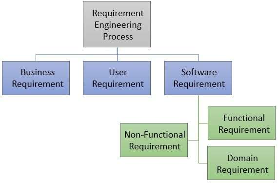

> **Figure** **1:** **Types** **of** **requirements** **in** **RE**
>
> **Role** **of** **Requirements** **in** **SDLC**

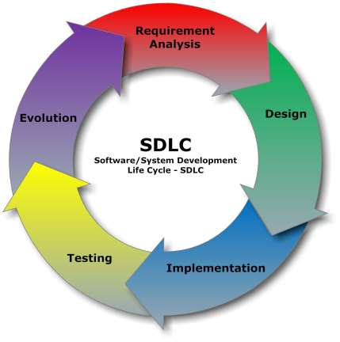• Initial phase of project
planning.

• Basis for project estimation and planning.

• Guides design, implementation, testing and maintenance.

• SDLC offers an organized method that guarantees effectiveness, quality
and risk reduction all the way through the development process.

• Teams may satisfy client expectations, manage projects more
effectively and produce dependable software by conforming to a specified
SDLC.

> **Figure** **2:** **SDLC** **Phases**

**User** **Needs** **vs.** **System** **Requirements**

||
||
||
||
||
||
||

> **Business** **vs.** **Technical** **Requirements**

||
||
||
||
||
||
||

> **Functional** **Requirements** **and** **Non-Functional**
> **Requirements**

• FR defines system behavior and functions. Example: “System must allow
users to log in”.

• NFR defines system attributes like performance, usability.

• Often affect user satisfaction.

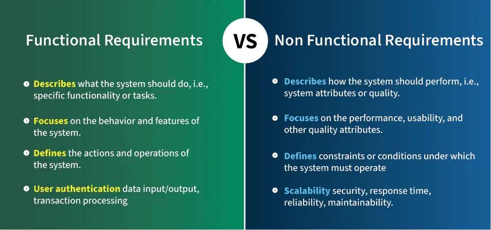**Functional**
**Requirements** **and** **Non-Functional** **Requirements**
**\[Cont.\]**

> **User,** **System** **and** **Business** **Requirements**

• User: What users expect to do.

• System: Detailed technical description.

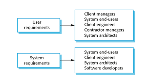•
Business: Alignment with business goals. From a business standpoint,
business requirements specify what the software system must do in order
for the company to reach its objectives.

> **Examples** **of** **Critical** **NFRs**

||
||
||
||
||
||
||
||

> **Requirements**
> **Engineering** **Phases**

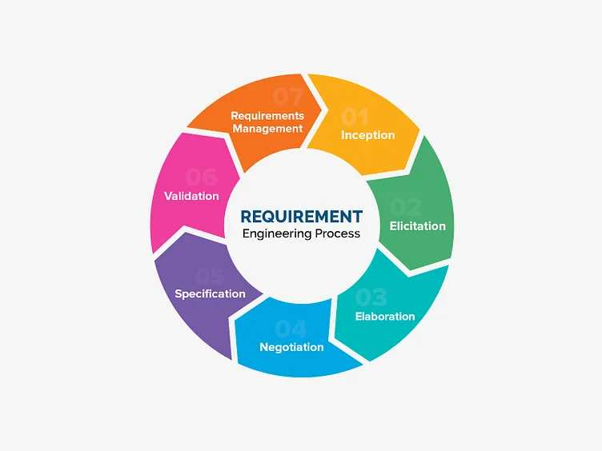•
The phases are: 1. Inception

2\. Elicitation 3. Elaboration 4. Negotiation

5\. Specification 6. Validation

7\. Req. Management

> **Figure** **3:** **RE** **Phases**

• Cyclical and iterative process

> **1.** **Inception**
>
> • This phase involves identifying the initial idea and understanding
> the basic needs and scope of the project.
>
> • It sets the foundation for further detailed analysis and planning.

**2.** **Elicitation**

> • During elicitation, requirements are gathered from stakeholders
> using some techniques.
>
> • Understanding stakeholders’ real needs.
>
> • Techniques: Interviews, Surveys, Workshops.
>
> **3.** **Elaboration**

• In this phase, requirements are analyzed and refined to resolve
ambiguities, define detailed specifications and establish a clear
understanding of functionalities of the system.

> **4.** **Negotiation**

• Here, conflicting requirements are resolved through discussions with
stakeholders, prioritizing needs and reaching an agreement on the most
feasible and valuable features.

> **5.** **Specification**
>
> • Need to create a documentation based on requirements (like SRS,
> PRD).
>
> • Clarity, consistency, completeness

**6.** **Validation**

• This phase verifies that the documented requirements accurately
reflect stakeholder needs and are feasible,

> ensuring that the system will meet its intended purpose.
>
> • Checking for correctness, feasibility. • Techniques: Reviews,
> Prototyping
>
> **7.** **Requirements** **Management**

• Throughout the project, requirements are managed to accommodate
changes, track revisions and ensure that the evolving needs are properly
incorporated and controlled.

> 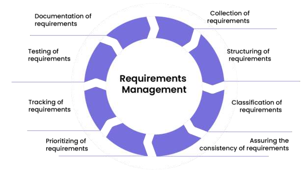**Figure**
> **4:** **Requirements** **Management**
>
> **Challenges** **in** **Requirements** **Engineering**

||
||
||
||
||
||
||
||

> **Scope** **Creep**
>
> • Uncontrolled changes in requirements. • Impact: Delays, budget
> overruns.
>
> • Prevention: Clear documentation, approval processes.

**Communication** **Gaps**

> • Between stakeholders and developers. • Causes misunderstandings.
>
> • Solutions: Prototypes, regular meetings.
>
> **Impact** **of** **Poor** **Requirements** **in** **S/W**
> **Projects**

• Inaccurate scope, budget issues.

• Failed projects due to misunderstood requirements.

• Cause misunderstandings and misaligned expectations.

• For example, the FBI Virtual Case File project failed because of vague
and incomplete requirements, resulting in a significant budget overrun
and eventual cancellation.

• Another case is the Denver International Airport's automated baggage
handling system, which was plagued by unclear requirements, leading to
extensive delays and cost overruns.

> **Boehm’s** **Law**

• According to Boehm's Law, commonly referred to as the Law of Costly
Errors, the later a software flaw is discovered in the development
lifecycle, the more expensive it is to solution.

• To put it simply, it will cost significantly more to fix a bug during
testing than it will to cure it during developing and it will cost even
more to solve a bug after the software has been deployed.

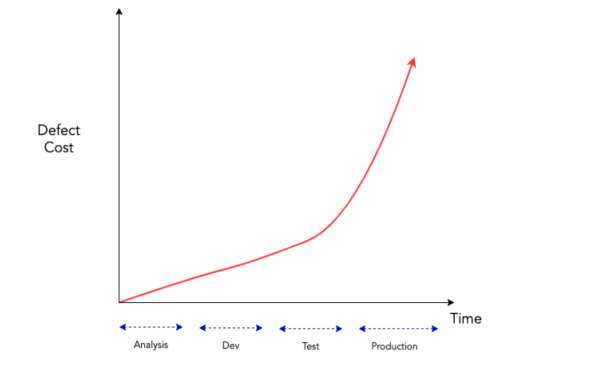**Boehm’s**
**Law** **(Cont.)**

> **User** **Stories** **vs** **Traditional** **SRS**
>
> User stories: Simple, customer-focused statements. SRS: Software
> Requirements Specification.

||
||
||
||
||
||
||
||

> **The** **Requirements** **Baseline**



||
||
||
||

A meaningful baselining process gives all the major stakeholders
confidence in the following ways:

• Customer management or marketing is confident that the project scope
won’t explode out of control, because customers manage the scope change
decisions.

• User representatives have confidence that the development team will
work with them to deliver the right solution, even if they didn’t think
of every requirement before construction began.

• Development management has confidence because the development team has
a business partner who will keep the project focused on achieving its
objectives and will work with development to balance schedule, cost,
functionality, and quality.

• Business analysts and project managers are confident that they can
manage changes to the project in a way that will keep chaos to a
minimum.

• Quality assurance and test teams can confidently develop their test
scripts and be fully prepared for their project activities.

> **Shift-Left** **Testing**

• A software testing approach that involves performing testing
activities early in the software development life cycle (SDLC),
typically during the requirements, design or development phases, instead
of waiting until after implementation.

• Shift-left testing: Test implementation; Test often

early; Test before using requirements.

> **References**

[•
<u>https://datarob.com/essentials-software-development-life-cycle/</u>](https://xebrio.com/what-is-requirements-management-a-complete-guide/)

[•
<u>https://www.geeksforgeeks.org/software-engineering/functional-vs-non-functional-requirements/</u>](https://xebrio.com/what-is-requirements-management-a-complete-guide/)

[•
<u>https://dribbble.com/shots/4715049-Requirement-Engineering-Process</u>](https://xebrio.com/what-is-requirements-management-a-complete-guide/)

[•
<u>https://xebrio.com/what-is-requirements-management-a-complete-guide/</u>](https://xebrio.com/what-is-requirements-management-a-complete-guide/)

[•
<u>https://www.geeksforgeeks.org/software-engineering/software-engineering-challenges-eliciting-requirements/</u>](https://www.geeksforgeeks.org/software-engineering/software-engineering-challenges-eliciting-requirements/)

[•
<u>https://rnjn.in/glossary/boehms-law/</u>](https://rnjn.in/glossary/boehms-law/)

[•
<u>https://www.atlassian.com/devops/what-is-devops/agile-vs-devops</u>](https://www.atlassian.com/devops/what-is-devops/agile-vs-devops)

[•
<u>https://www.agilebusiness.org/dsdm-project-framework/moscow-prioririsation.html</u>](https://www.agilebusiness.org/dsdm-project-framework/moscow-prioririsation.html)

> CHAPTER 4
>
> <u>COURSE NAME</u> AGILE SOFTWARE DEVELOPMENT
>
>  style="width:8.13139in;height:0.115in" />SOFTWARE ENGINEERING
>
> CSC 3114

(UNDERGRADUATE)

> MD RAIHAN MAHMUD LECTURER,CS, AIUB
> [<u>raihan.mahmud@aiub.edu</u>](mailto:Raihan.mahmud@aiub.edu)

WHAT IS AN AGILE METHOD?

Agile methods are considered

>  Lightweight (do not concentrate on the whole software development at
> once)  People-based rather than Plan-based

Several agile methods

>  No single agile method
>
>  Different agile methods can be combined in software development
> (Hybrid)
>
> RM

AGILE DEVELOPMENT

> “Plan-driven methods work best when developers can determine the
> requirements in advance ...and when the requirements remain relatively
> stable,with change rates on the order of one percent per month.”*~*
> *Barry* *Boehm*
>
> Companies need to
>
>  innovate better and faster operations  respond quickly to
>
> \- competitive initiatives - new technology
>
> \- customer's requirements
>
> RM
>
> AGILE MODEL

Subset of iterative and evolutionary methods **<u>Iterative
Products</u>**

Each iteration is a self-contained,mini-project with activities that
span requirements analysis, design,implementation,and test

Leads to an iteration release (which may be only an internal release)
that integrates all software across the team and is a growing and
evolving subset of the final system

The purpose of having short iterations is so that feedback from
iterations N and earlier, and any other new information,can lead to
refinement and requirements adaptation for iteration N + 1

> RM

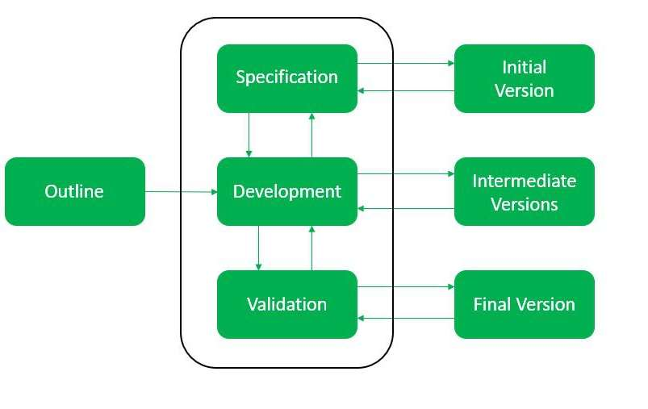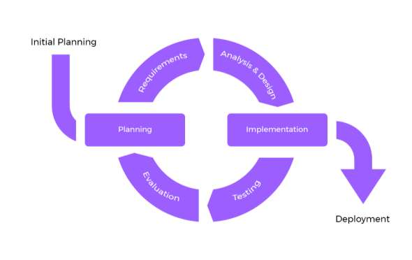

EVOLUTIONARY + ITERATIVE MODEL = AGILE

> 55

AGILE METHODS VS. PAST ITERATIVE METHODS

> A key difference between agile methods and past iterative methods is
> the length of each iteration.
>
> In the past,iterations might have been three or six months long.
>
> In agile methods,iteration lengths vary between one to four weeks and
> intentionally do not exceed 30 days.
>
> Research has shown that shorter iterations have lower complexity and
> risk,better feedback,and higher productivity and success rates.
>
> RM

TIMEBOX & SCOPE

> The pre-determined iteration length serves as a timebox for the team.
> Scope (set of tasks) is chosen for each iteration to fill the
> iteration length.
>
> Rather than increase the iteration length to fit the chosen scope,
> the scope is reduced to fit the iteration length.
>
> RM
>
> AGILE VS. PLAN DRIVEN PROCESS

||
||
||
||
||
||
||
||

> RM

AGILE ASSUMPTION

> It is difficult to predict in advance which software requirements
> will persist and which will change
>
> It is equally difficult to predict how customer priorities will
> change as the project proceeds
>
> Design and construction are interleaved in many types of
> software.That is,both activities should be performed tightly so that
> design models are proven as they are created.It is difficult to
> predict how much design is necessary before construction is used to
> prove the design.
>
> Analysis,design,construction,and testing are not as predictable (from
> a planning point of view) as we might like.
>
> RM

HUMAN FACTORS IN AGILE DEVELOPMENT

>  Skill / Capability
>
>  Common focus
>
>  Collaboration
>
>  Decision-making ability
>
>  Fuzzy problem-solving ability
>
>  Mutual trust and respect
>
>  Self-organization
>
> RM

AGILE METHODS

> Extreme Programming (XP) Scrum
>
> Dynamic Systems Development Method (DSDM) Feature-Driven Development
> (FDD)
>
> Crystal Methods Lean Development (LD)
>
> Adaptive Software Development (ASD)
>
> RM

REFERENCES

> R.S.Pressman & Associates,Inc.(2010).*Software* *Engineering:A*
> *Practitioner’s* *Approach.*
>
> Kelly,J. C., Sherif,J. S., & Hops,J. (1992).An analysis of defect
> densities found during software inspections.*Journal* *of* *Systems*
> *and* *Software*,*17*(2), 111-117.
>
> Bhandari,I.,Halliday,M. J., Chaar,J., Chillarege,R.,Jones,
> K.,Atkinson, J. S., & Yonezawa,M. (1994). In-process improvement
> through defect data interpretation.*IBM* *Systems* *Journal*,*33*(1),
> 182-214.
>
> RM

> CHAPTER 5
>
> <u>COURSE NAME</u> EXTREME PROGRAMMING (XP)
>
>  style="width:8.13139in;height:0.115in" />SOFTWARE ENGINEERING

CSC 3114 (UNDERGRADUATE)

> MD RAIHAN MAHMUD LECTURER,CS, AIUB
> [<u>raihan.mahmud@aiub.edu</u>](mailto:Raihan.mahmud@aiub.edu)

EXTREME PROGRAMMING

> Evolved from the problems caused by the long development cycles of
> traditional development models (Beck 1999a).
>
> First started as 'simply an opportunity to get the job done‘ (Haungs
> 2001) with practices that had been found effective in software
> development processes during the preceding decades (Beck 1999b)
>
> Method is formed around common sense principles and simple to
> understand practices
>
> No process fits every project,rather,simple practices should be
> tailored to suit an individual project
>
> RM

XP VALUES

> **Communication:** XP has a culture of oral communication and its
> practices are designed to encourage interaction.
>
> “Problems with projects can invariably be traced back to somebody not
> talking to somebody else about something important.”
>
> **Simplicity:** Design the simplest product that meets the customer’s
> needs. An important aspect of the value is to only design and code
> what is in the current requirements rather than to anticipate and plan
> for unstated requirements.
>
> RM

XP VALUES

> **Feedback:**The development team obtains feedback from the customers
> at the end of each iteration and external release.This feedback drives
> the next iteration.
>
> **Courage**: Allow the team to have courage in its actions and
> decision making.For example, the development team might have the
> courage to resist pressure to make unrealistic commitments.
>
> **Respect:**Team members need to care about each other and about the
> project.
>
> RM

XP PROCESS MODEL

 The life cycle of XP consists of six phases: 1. Exploration

2\. Planning

3\. Iterations to Release 4. Productionizing

5\. Maintenance 6. Death

> RM
>
> 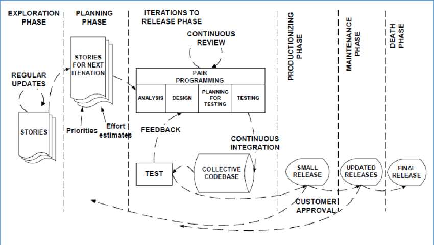 style="width:13.24667in;height:7.45in" />68

XP PROCESS – EXPLORATION PHASE

> The customers write out the story cards that they wish to be included
> in the first release
>
> At the same time the project team familiarize themselves with the
> tools,technology and practices they will be using in the project
>
> The exploration phase takes between a few weeks to a few
> months,depending largely on how familiar the technology is to the
> programmers
>
> RM

XP PROCESS – PLANNING PHASE

> Users stories are written
>
> Estimate the effort of working with the user stories Priorities are
> given to the user stories to be implemented Release planning creates
> the release schedule
>
> RM
>
> XP PROCESS – ITERATIONS TO RELEASE PHASE

Includes several iterations of the systems before the first release
Each takes one to four weeks to implement

The first iteration creates a system with the architecture of the whole
system. This is achieved by selecting the stories that will enforce
building the structure

> for the whole system

The customer decides the stories to be selected for each iteration  At
the end of the last iteration,the system is ready for production

> RM

XP PROCESS – PRODUCTIONIZING PHASE

Requires extra testing and checking of the performance of the system
before the system can be released to the customer

New changes may still be found and the decision has to be made if they
are included in the current release

The iterations may need to be quickened from three weeks to one week
The postponed ideas and suggestions are documented for later
implementation

> RM

XP PROCESS – MAINTENANCE PHASE

After the first release is productionized for customer use,the XP
project must both keep the system in the production running while also
producing new iterations

Requires an effort also for customer support tasks

Development velocity may decelerate after the system is in production

May require incorporating new people into the team and changing the
team structure

> RM

XP PROCESS – DEATH PHASE

When the customer does no longer have any stories to be implemented

System satisfies customer needs also in other respects (e.g.,concerning
performance and reliability)

Necessary documentation of the system is finally written as no more
changes to the architecture,design or code are made

Death may also occur if the system is not delivering the desired
outcomes,or if it becomes too expensive for further development

> RM

XP - ROLES AND RESPONSIBILITY

 **Customer:** writes the stories and functional tests,and decides when
each requirement is satisfied.The customer sets the implementation
priority for the requirements

 **Programmer:** keeps the program code as simple and definite as
possible.

**Tester:**helps the customer write functional tests,also run
functional tests regularly, broadcast test results and maintain testing
tools

**Tracker:** gives feedback in XP. He traces the estimates made by the
team (e.g.

> effort estimates) and gives feedback on how accurate they are in order
> to improve future estimations. He also traces the progress of each
> iteration and evaluates whether the goal is reachable within the given
> resource and time constraints or if any changes are needed in the
> process
>
> RM

XP - PRACTICES

**Interaction:**Close interaction between the customer and the
programmers.The programmers estimate the effort needed for the
implementation of customer stories and the customer then decides about
the scope and timing of releases.

**Small/short** **releases:**A simple system is "productionized“
rapidly – at least once in every 2 to 3 months.New versions are then
released even daily,but at least monthly.

**Metaphor:**The system is defined by a metaphor/set of metaphors
between the customer and the programmers.This "shared story" guides all
development by describing how the system works.

> RM
>
> XP - PRACTICES

**Pair** **programming**

>  Two people write the code at one computer
>
>  One programmer,the driver,has control of the keyboard/mouse and
> actively implements the program.The other programmer,the
> observer,continuously observes the work of the driver to identify
> tactical defects (syntactic,spelling,etc.) and also thinks
> strategically about the direction of the work.
>
>  Two programmers can brainstorm any challenging problem.Because they
> periodically switch roles.

**Continuous** **integration:**A new piece of code is integrated into
the code-base as soon as it is ready.

> RM

XP - PRACTICES

> **40-hour** **week:**A maximum of 40-hour working week
>
> **On-site** **customer:**Customer has to be present and available
> full-time for the team

**Coding** **standards:**Coding rules exist and are followed by the
programmers (e.g.error message by exception handling).Communication
through the code should be emphasized

> **Open** **workspace:**A large room with small cubicle (compartment)
> is preferred
>
> **Just** **rules:**Team has its own rules that are followed,but can
> also be changed at any time. The changes have to be agreed upon and
> their impact has to be assessed
>
> RM
>
> XP -ARTEFACTS

**User** **story** **cards**

> Paper index cards which contain brief requirement
> (features,non-functional) descriptions Not a full requirement
> statement
>
> Commitment for further conversation between the developer and the
> customer
>
> During this conversation,the two parties will come to an oral
> understanding of what is needed for the requirement to be fulfilled
>
> Customer priority and developer resource estimate are added to the
> card The resource estimate for a user story must not exceed the
> iteration duration
>
> RM
>
> XP -ARTEFACTS

**Task** **list**

> A listing of the tasks (one-half to three days in duration) for the
> user stories that are to be completed for an iteration
>
> Tasks represent concrete aspects of a user story
>
> Programmers volunteer for tasks rather than are assigned to tasks
>
> RM

REFERENCES

> R.S.Pressman & Associates,Inc.(2010).*Software* *Engineering:A*
> *Practitioner’s* *Approach.*
>
> Kelly,J. C., Sherif,J. S., & Hops,J. (1992).An analysis of defect
> densities found during software inspections.*Journal* *of* *Systems*
> *and* *Software*,*17*(2), 111-117.
>
> Bhandari,I.,Halliday,M. J., Chaar,J., Chillarege,R.,Jones,
> K.,Atkinson, J. S., & Yonezawa,M. (1994). In-process improvement
> through defect data interpretation.*IBM* *Systems* *Journal*,*33*(1),
> 182-214.
>
> RM

> CHAPTER 6
>
> <u>COURSE NAME</u> SCRUM
>
>  style="width:8.13139in;height:0.115in" />SOFTWARE ENGINEERING

CSC 3114 (UNDERGRADUATE)

> MD RAIHAN MAHMUD LECTURER, CS, AIUB
> [<u>raihan.mahmud@aiub.edu</u>](mailto:Raihan.mahmud@aiub.edu)

SCRUM

> The first references in the literature to the term 'Scrum‘ point to
> the article ofTakeuchi and Nonaka (1986) in which an adaptive,quick,
> self-organizing product development process originating from Japan is
> presented (Schwaber and Beedle 2002).
>
> The term 'scrum' originally derives from a strategy in the game of
> rugby where it denotes "getting an out-of play ball back into the
> game" with teamwork (Schwaber and Beedle 2002).
>
>  SCRUM process includes three phases  Pre-game
>
>  Game phase (development)  Post-game
>
> RM

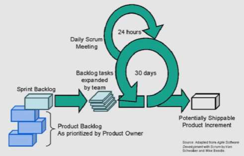

SCRUM PROCESS

> RM

PRE-GAME PHASE

> The pre-game phase includes two sub-phases:
>
> **1.** **Planning:**
>
>  Definition of the system being developed
>
>  A Product Backlog list is created containing all the requirements
> that are currently known
>
>  The requirements are prioritized and the effort needed for their
> implementation is estimated
>
>  The product Backlog list is constantly updated with new and more
> detailed items, as well as with more accurate estimations and new
> priority orders
>
>  Planning also includes the definition of the project team, tools and
> other resources, risk assessment and controlling issues, training
> needs and verification management approval
>
> RM

PRE-GAME PHASE

**2.** **Architecture**

The high level design of the system including the architecture is
planned based on the current items in the Product Backlog

In case of an enhancement to an existing system,the changes needed for
implementing the Backlog items are identified along with the problems
they may cause

A design review meeting is held to go over the proposals for the
implementation and decisions are made on the basis of this review

> RM
>
> DEVELOPMENT (GAME) PHASE

This phase is treated as a "black box" where the unpredictable is
expected The system is developed in Sprints

> Sprints are iterative cycles where the functionality is developed or
> enhanced to produce new increments.
>
> Each Sprint includes the traditional phases of software
> development:requirements, analysis,design,evolution and delivery
> phases.
>
> One Sprint is planned to last from one week to four week (not exceed
> one month).
>
> RM

POST-GAME PHASE

> This phase is entered when an **agreement** has been made such as the
> requirements are completed.
>
> In this case,**no** **more** **items** **and** **issues** can be
> found nor can any new ones be invented.
>
> The system is now ready for the **release** and the preparation for
> this is done during the post-game phase,including the tasks such as
> the integration,system testing and documentation.
>
> RM

ROLES AND RESPONSIBILITIES

> **Scrum** **Master**
>
>  Scrum Master is responsible for ensuring that the project is carried
> through according to the practices, values,and rules of Scrum and that
> it progresses as planned.
>
>  Scrum Master interacts with the project team as well as with the
> customer and the management during the project.
>
> **Product** **Owner**
>
>  Product Owner is officially responsible for the project,
> managing,controlling,and making visible the Product Backlog list.
>
>  He is selected by the Scrum Master, the customer, and the
> management.
>
>  He makes the final decisions of the tasks related to product
> Backlog.
>
> RM

ROLES AND RESPONSIBILITIES

> **ScrumTeam**
>
> Scrum Team is the project team that has the authority to decide on
> the necessary actions and to organize itself in order to achieve the
> goals of each Sprint.
>
> The scrum team is involved,for example, in effort estimation,
> creating the Sprint Backlog,reviewing the product Backlog list and
> suggesting impediments that need to be removed from the project.
>
> **Customer**
>
> Customer participates in the tasks related to product Backlog items
> for the system being developed or enhanced.
>
> **Management**
>
> Management is in charge of final decision making,along with the
> agreements, standards,and conventions to be followed in the project.
>
> Management also participates in the setting of goals and
> requirements.
>
> RM

SCRUM PRACTICES

**Product** **Backlog** **&** **Sprint**

Sprint is the procedure of adapting to the changing environmental
variables (requirements, time, resources, knowledge,technology etc.).

The working tools of the team are Sprint Planning Meetings, Sprint
Backlog,and Daily Scrum meetings.

**Effort** **Estimation** **&** **Sprint** **Backlog**

 Sprint Backlog is the starting point for each Sprint.It is a list of
Product Backlog items selected to be implemented in the next Sprint.

 The items are selected by the Scrum Team together with the Scrum
Master and the Product Owner in the Sprint Planning meeting, on the
basis of the prioritized items and goals set for the Sprint.

 Unlike the Product Backlog,the Sprint Backlog is stable until the
Sprint (i.e. 30 days) is completed. When all the items in the Sprint
Backlog are completed,a new iteration of the system is delivered.

> RM
>
> SCRUM PRACTICES

**Sprint** **Planning** **meeting**

 A Sprint Planning Meeting is a two-phase meeting organized by the
Scrum Master.

 The Scrum Master,Management,Product Owner,and ScrumTeam participate in
the first phase of the meeting to decide upon the goals and the
functionality of the next Sprint.

 The second phase of the meeting is held by the Scrum Master and the
ScrumTeam focusing on how the product increment is implementedduring the
Sprint.

**Daily** **Scrum** **meeting**

 Daily Scrum meetings are organized to keep track of the **progress**
of the ScrumTeam continuously and they also serve as planning
meetings:what has been done since the last meeting and what is to be
done before the next one.

**Sprint** **Review** **meeting**

 On the **last** **day** of the Sprint,the ScrumTeam and the Scrum
Master present the results (i.e.working product increment) of the Sprint
to the management,customers,users,and the Product Owner in an informal
meeting.

> RM

REFERENCES

> R.S.Pressman & Associates,Inc.(2010).*Software* *Engineering:A*
> *Practitioner’s* *Approach.*
>
> Kelly,J. C., Sherif,J. S., & Hops,J. (1992).An analysis of defect
> densities found during software inspections.*Journal* *of* *Systems*
> *and* *Software*,*17*(2), 111-117.
>
> Bhandari,I.,Halliday,M. J., Chaar,J., Chillarege,R.,Jones,
> K.,Atkinson, J. S., & Yonezawa,M. (1994). In-process improvement
> through defect data interpretation.*IBM* *Systems* *Journal*,*33*(1),
> 182-214.
>
> RM

> CHAPTER 7
>
> THE DYNAMIC SYSTEMS DEVELOPMENT <u>COURSE NAME</u> METHOD (DSDM)
>
>  style="width:8.13139in;height:0.115in" />SOFTWARE ENGINEERING

CSC 3114 (UNDERGRADUATE)

> MD RAIHAN MAHMUD LECTURER,CS, AIUB
> [<u>raihan.mahmud@aiub.edu</u>](mailto:Raihan.mahmud@aiub.edu)

DSDM

> **The** **Dynamic** **Systems** **Development** **Method** **(DSDM)**
> is a public domain RapidApplication Development method which has been
> developed through capturing the experience of a large group of vendor
> and user organisations.
>
> **It** **is** **now** **considered** **to** **be** **the** **UK's**
> **de-facto** **standard** **for** **RAD.**
>
> The key to DSDM is to deliver **what** business needs **when** it
> needs.
>
>  Achieved by using the various techniques in the framework and
> flexing requirements
>
>  The aim is always to address the current and imminent needs of the
> business rather than to attack all the perceived possibilities
>
> RM

TRADITIONAL METHOD VS.DSDM

||
||
||
||
||

> **11**

||
||
||
||
||

> **87%**

**77%**

> **Average** **time** **to** **delivery** **(in** **months)**

**Average** **project** **team** **size** **%** **of** **completed**
**projects** **rated** **good** **to** **excellent**

> **Using** **traditional** **approaches**
>
> **Using** **DSDM** **Source:BritishAirways** **IM** **Department,**
> **Newcastle**
>
> RM

DSDM PROCESSVIEW

> RM
>
> DSDM PROCESS

||
||
||
||
||

> RM
>
> DSDM PROCESS

||
||
||
||
||
||
||

> RM
>
> DSDM

**Activity**

PROCESS

> **Sub** **activity** **Description**
>
> **Design** **and** **Build** **Iteration**

Identify design prototype

Agree schedule

Create design prototype

Identify functional and **non-functiona**l requirements that need to be
in the tested system.And based on these identifications,an
IMPLEMENTATION STRATEGY is involved.If there is aTEST RECORD from the
previous iteration,then it will be also used to determine the
IMPLEMENTATION STRATEGY.

Agree on how and when to realize these requirements.

Create a system (DESIGN PROTOTYPE) that can safely be handed to
end-users for daily use,also for testing purposes.

> Review design prototype

Check the correctness of the designed system.Again,testing and reviewing
are the main techniques used.A USER DOCUMENTATION and aTEST

RECORD will be developed. RM

> DSDM PROCESS

||
||
||
||
||
||
||

RM

DIFFERENCE BETWEENTRADITIONAL DEVELOPMENTVS.DSDM

> Functionality Time Resources
>
> *Fixed*
>
> **DSDM** <u>Traditional Method</u>
>
>  Functional/requirements are fixed
>
>  Time & resources can vary
>
> **Traditional** *Vary*
>
> Time Resources
>
> <u>DSDM/Agile Methods</u>

Functionality  Functional/requirement varies

>  Time & resources are fixed
>
> RM

TECHNIQUESTO CONSIDER IN DSDM

> Flexibility \[80:20 Rule\] Timeboxing MoSCoW Rules Prototyping
>
> RM
>
> DSDM TECHNIQUES:FLEXIBILITY

A fundamental assumption of DSDM is that nothing is built perfectly
first time.

80:20 Rule: The 80/20 rule says that you can get 80% of the value from
a project by focusing on the 20% of needs that are the most important.

DSDM assumes that all previous steps can be revisited as part of its
iterative approach.

Therefore,the current step need be completed only enough to move to the
next step,since it can be finished in a later iteration.

> RM
>
> DSDM TECHNIQUES: TIMEBOXING

Without effective timeboxing, prototyping teams can lose their focus
and run out of control.

Timeboxing works by concentrating on when a business objective will be
met as opposed to the tasks which contribute to its delivery.

**Timeboxing** **Basics**

>  Time between start and end of an activity
>
>  DSDM uses nested timeboxes,giving a series of fixed deadlines
>
>  Ideally **2** **-** **4** **weeks** in length
>
>  Objective is to have easiest 80% produced in each timebox
>
>  Remaining 20% potentially carried forward subsequent timeboxes
>
>  Focus on the essentials
>
>  Helps in estimating and providing resources
>
> RM
>
> DSDM TECHNIQUES: MOSCOW RULES
>
>  **MoSCoW** rules formalised in DSDM version 3 **Must** **have** –
> fundamental to project success
>
> **Should** **have** – important but project does not rely on **Could**
> **have** – left out without impacting on project
>
> **Want** **to** **have** **but** **Won't** **have** this time for
> those valuable requirements that can wait till later development takes
> place; in other words,the Waiting List.

||
||
||
||
||
||
||

> DSDM TECHNIQUES: PROTOTYPING

**Prototypes** **are** **necessary** **in** **DSDM** **because**

Facilitated workshops define the high-level requirements and strategy

Prototypes provide the mechanism through which users can ensure that
the detail of the requirements is correct

Demonstration of a prototype broadens the users awareness of the
possibilities and assists them in giving feedback to the developers

Speeds up the development process and increases confidence that the
right solution will be delivered

> RM

REFERENCES

> R.S.Pressman & Associates,Inc.(2010).*Software* *Engineering:A*
> *Practitioner’s* *Approach.*
>
> Kelly,J. C., Sherif,J. S., & Hops,J. (1992).An analysis of defect
> densities found during software inspections.*Journal* *of* *Systems*
> *and* *Software*,*17*(2), 111-117.
>
> Bhandari,I.,Halliday,M. J., Chaar,J., Chillarege,R.,Jones,
> K.,Atkinson, J. S., & Yonezawa,M. (1994). In-process improvement
> through defect data interpretation.*IBM* *Systems* *Journal*,*33*(1),
> 182-214.
>
> RM

> CHAPTER 8
>
> <u>COURSE NAME</u> FEATURE DRIVEN DEVELOPMENT (FDD)
>
>  style="width:8.13139in;height:0.115in" />SOFTWARE ENGINEERING
>
> CSC 3114

(UNDERGRADUATE)

MD RAIHAN MAHMUD LECTURER, CS, AIUB
[<u>raihan.mahmud@aiub.edu</u>](mailto:Raihan.mahmud@aiub.edu)

WHAT IS FDD?

>  Feature Driven Development (FDD)
>
>  FDD is an agile software development process
>
>  FDD uses a short-iteration model
>
>  FDD combines key advantages of other popular agile approaches along
> with other industry-recognized best practices
>
>  FDD was created to easily scale to much larger projects and teams
>
> RM

WHAT IS A FEATURE?

>  FDD delivers the system feature by feature
>
>  Feature is a small function expressed in client-valued terms which
> presents the customer requirements to be developed in software using
> small iteration
>
>  Features are to be“small” in the sense they will take no more than
> two weeks to complete Features that appear to take longer are to be
> broken up into a set of smaller features.Two weeks is the maximum,
> most features take less time (1 - 5 days)
>
>  Feature naming template:
>
> **\<action\>** **the** **\<result\>** **\<by\|for\|of\|to\>** **a(n)**
> **\<object\>** **Calculate** **the** **vote** **of** **a**
> **national** **election**
>
>  Examples: Calculate the total of a sale Validate the password of a
> user
>
> Authorize the sales transaction of a customer
>
> RM

FDD ROLES

> FDD Primary Roles

||
||
||
||

> FDD Supporting Roles

||
||
||
||
||
||

> RM

FDD PROCESS

> Process \#1: Develop an Overall Model
>
> Process \#2: Build a Features List
>
> Process \#3: Plan By Feature
>
> Process \#4: Design By Feature
>
> Process \#5: Build By Feature
>
> RM
>
> FDD PROCESS

Project wide upfront design activities:

>  Process \#1: Develop an Overall Model
>
>  Process \#2: Build a Features List
>
>  Process \#3: Plan By Feature
>
>  Goal:not to design the system in its entirety but instead is to do
> just enough initial design that you are able to build on

Deliver the system feature by feature:

>  Process \#4: Design By Feature
>
>  Process \#5: Build By Feature
>
>  Goal:Deliver real,completed,client-valued function as often as
> possible
>
> RM

FDD PROCESS

> 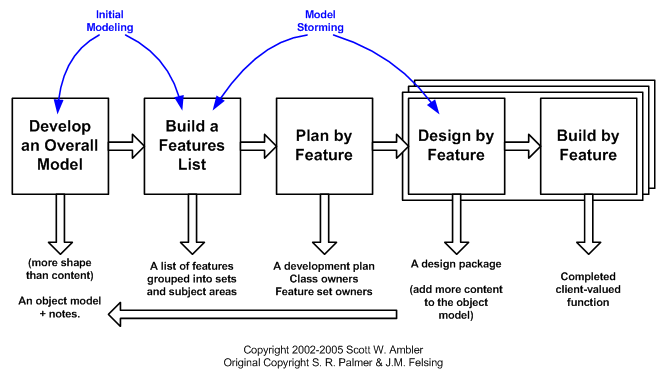RM
>
> FDD PROCESS

**Process** **\#1:Develop** **an** **Overall** **Model**

>  Form a modeling team
>
>  Domain walk-through
>
>  Build High-level object model
>
>  Record Notes
>
>  **Goal** - for team members to gain a good,shared understanding of
> the problem domain and build a foundation

**Process** **\#2:Build** **a** **Features** **List**

>  All Features are organized in a three level hierarchy :

Domain SubjectArea Business Activity

> Features
>
> RM

FDD PROCESS

> **Process** **\#3:Plan** **by** **Feature**
>
> Construct initial schedule
>
> Formed on level of individual features
>
> \- Prioritize by business value
>
> \- Also consider dependencies,difficulty,and risks
>
> Assign responsibilities to team members
>
> Determine Class Owners
>
> Assign feature sets to chief programmers
>
> RM

FDD PROCESS

> **Process** **\#4:Design** **by** **Feature**
>
>  Form Feature Teams
>
>  Team members collaborate on the full low level analysis and design
>
>  Certain features may require teams to bring in domain experts
>
>  Teams need to update the model artifact to support their changes
> **Feature** **Team**
>
>  Chief Programmers pick teams based on the current feature in
> development  Chief Programmers lead picked team (usually 3 to 5
> people)
>
>  Upon completion of the current feature the team diRMands
>
>  Each team will concurrently work on their own independent iteration
>
>  Possible to be on multiple teams at once
>
> RM

FDD PROCESS

> **Process** **\#5:Build** **by** **Feature**
>
>  Implement designed feature
>
>  Test feature
>
> \- Unit-level
>
> \- Feature-level
>
>  Mandated Code Inspections (formal review with checklist)
>
>  Integrate with regular build
>
> RM
>
> FDD PROCESS

**Mandated** **Code** **Inspections** for Two Main Reasons

>  Research has shown that when it is done properly, inspections find
> more bugs as well as different types of bugs than any other form of
> testing.
>
>  It is also a great learning experience

**Reporting**

>  FDD emphasizes the ability to provide accurate, meaningful, and
> timely progress information to all stakeholders within and outside the
> project
>
>  Feature Milestones
>
> RM

REFERENCES

> R.S.Pressman & Associates,Inc.(2010).*Software* *Engineering:A*
> *Practitioner’s* *Approach.*
>
> Kelly,J. C., Sherif,J. S., & Hops,J. (1992).An analysis of defect
> densities found during software inspections.*Journal* *of* *Systems*
> *and* *Software*,*17*(2), 111-117.
>
> Bhandari,I.,Halliday,M. J., Chaar,J., Chillarege,R.,Jones,
> K.,Atkinson, J. S., & Yonezawa,M. (1994). In-process improvement
> through defect data interpretation.*IBM* *Systems* *Journal*,*33*(1),
> 182-214.
>
> RM
